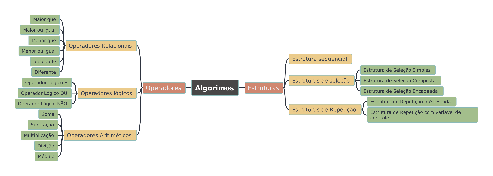

# 1. Introdução Curso Desenvolvimento Web

## 1.1. Visão Geral do Curso Desenvolvimento Web

 1. Visão geral
 2. Configuração do Ambiente
 3. Fundamentos
 4. Estruturas de Controle
 5. Funções 
 6. Objetos & OO
 7. Array
 8. Node
 9. ES Next... 6, 7, 8
 10. Fundamentos da Web
 11. HTML
 12. CSS
 13. DOM
 14. Ajax
 15. Gulp
 16. Webpack
 17. JQuerry
 18. Bootstrap
 19. React
 20. Vue
 21. Bancos de Dados Relacionais
 22. Bancos de Dados Não Relacionais
 23. Express
 24. Mongoose
 25. Projetos
 26. Outros Tópicos
 27. Conclusão

 # 2. Javascript: Fundamentos

 ## 2.1. Visão Geral de Algoritmo

 Um algoritmo é uma **sequência finita de ações** executáveis que visam obter uma solução para um determinado tipo de problema.

 > "algoritmos são procedimentos precisos, não ambíguos, padronizados, eficientes e corretos"

 **características** : Deve ser finito, o algoritmo deve eventualmente resolver o problema; bem definidas: os passos devem ser definidos de modo a serem entendidos; efetivas, deve sempre resolver o que tem para solucionar, antecipando falhas

 **exemplo** de uma receita culinária, embora muitos algoritmos sejam mais complexos. Eles podem repetir passos (fazer iterações) ou necessitar de decisões (tais como comparações ou lógica) até que a tarefa seja completada.

 O conceito de um algoritmo foi formalizado em **1936** pela **Máquina de Turing** de **Alan Turing** e pelo **cálculo lambda** de Alonzo Church, que formaram as primeiras fundações da Ciência da computação.

 **Um programa** de computador **é** essencialmente **um algoritmo** que diz ao computador aos passos específicos e em que ordem eles devem ser executados

 [Fonte: Algoritmo – Wikipédia, a enciclopédia livre](https://pt.wikipedia.org/wiki/Algoritmo)

 ### 2.1.1. Estrutura de controle

**estrutura de controle** (ou fluxo de controle) refere-se à ordem em que instruções, expressões e chamadas de função são executadas ou avaliadas em programas de computador sob programação imperativa ou funcional.

#### 2.1.1.1. Estrutura sequencial

**estrutura sequencial** é uma estrutura de desvio do fluxo de controle presente em linguagens de programação que realiza um conjunto predeterminado de comandos de forma sequencial, de cima para baixo, na ordem em que foram declarados.

~~~
Ação1;
Ação2;
Ação3;
Ação4;
Ação5;
~~~

#### 2.1.1.2. Estruturas de seleção

**Estrutura de seleção** (expressão condicional ou ainda estrutura condicional) é, uma estrutura de desvio do fluxo de controle presente em linguagens de programação que realiza diferentes computações ou ações dependendo se a seleção (ou condição) é verdadeira ou falsa

**Estrutura de Seleção Simples**: O desvio condicional simples permite executar um bloco de código caso o resultado do teste seja verdadeiro, ignorando um resultado falso.

~~~
se (condição) então
   Instruções caso condição retorne verdadeiro
fimse
~~~

---

**Estrutura de Seleção Composta**: O desvio condicional composto tem por finalidade tomar decisões de acordo com o resultado de uma condição (teste lógico), da mesma forma que o desvio condicional simples que estudamos na aula anterior. Porém, enquanto o condicional simples somente executa instruções quando o teste condicional retorna verdadeiro, o condicional composto permite criar dois blocos de código.

~~~
se (condição) então
    Instruções caso condição retorne verdadeiro
senão
    Instruções caso condição retorne falso
fimse
~~~

---

**Estrutura de Seleção Encadeada**:Existem situações nas quais é necessário verificar condições de teste sucessivas, onde uma ação será executada caso um conjunto anterior de ações seja satisfeito. Podemos usar para resolver esse tipo de problemas uma estrutura denominada Desvio Condicional Aninhado, que nada mais é do que o encadeamento de estruturas de decisão compostas em um algoritmo. Também chamamos a esse tipo de estrutura de Desvio Condicional Encadeado, por este motivo.

~~~
se (condição 1) então
    instruções caso condição 1 retorne verdadeiro
senão
   se (condição 2) então
        instruções caso condição 2 retorne verdadeiro
   senão
        instruções caso condição 2 retorne falso
   fimse
fimse
~~~

---

**Estrutura de Seleção múltipla escolha**:É utilizado para que seja possível escolher uma opção dentre várias existentes, eliminando a necessidade de se usar diversos Se..Então encadeados.

~~~
escolha <variável / expressão)
   caso <valor1>
comandos a executar
   caso <valor2>
comandos a executar
   caso <valor3>
comandos a executar
   outrocaso
comandos-padrão
fimescolha
~~~

#### 2.1.1.3. Estruturas de Repetição

**Estrutura de Repetição pré-testada**: A estrutura "enquanto" (também chamada "repetição pré-testada") é a mais difundida estrutura de repetição, e sua estrutura básica é a seguinte:

~~~
Enquanto (condição) Faça
    (bloco de código)
Fim Enquanto
~~~

**Estrutura de Pepetição pós-testada**:A estrutura "repita até" (também chamada "repetição pós-testada") é uma variação da estrutura anterior, e difere pois a verificação da condição é feita após uma execução do bloco. Sua estrutura básica é a seguinte:

~~~
Repita
    (bloco de código)
Ate (condição)
~~~

---

**Estrutura de Repetição com variável de controle**:A estrutura "para" (ou "repetição com variável de controle") é uma estrutura de repetição que designa uma variável de controle para cada iteração do bloco, e uma operação de passo a cada iteração. Sua estrutura básica é a seguinte:

~~~
Para (V) De (vi) Até (vf) Passo (p) Faça
    (bloco de código)
Fim Para
~~~

---

**Estrutura de Iteração de coleção**:A estrutura "para cada" é usada para iterar itens de uma coleção, sendo uma especialização da estrutura "para". Menos flexível que a estrutura "para", esta estrutura torna implícita a atribuição inicial e o incremento do passo, e determina que a condição de parada é somente a situação no qual todos os elementos do conjunto já foram iterados. Sua estrutura básica é:

~~~
Para Cada (item) De (conjunto) Faça
    (bloco de código)
Fim Para
~~~

[Fonte: Estrutura sequencial – Wikipédia, a enciclopédia livre](https://pt.wikipedia.org/wiki/Estrutura_sequencial)

[Fonte: Estrutura de controle – Wikipédia, a enciclopédia livre](https://pt.wikipedia.org/wiki/Estrutura_de_controle)

[Fonte: Estrutura de repetição – Wikipédia, a enciclopédia livre](https://pt.wikipedia.org/wiki/Estrutura_de_repeti%C3%A7%C3%A3o)

[Fonte: Lógica de Programação – Desvio Condicional Simples (SE…ENTÃO) - Bóson Treinamentos](http://www.bosontreinamentos.com.br/logica-de-programacao/10-logica-de-programacao-desvio-condicional-simples-se-entao/)

[Fonte: Lógica de Programação – Desvio Condicional Simples (SE…ENTÃO) - Bóson Treinamentos](http://www.bosontreinamentos.com.br/logica-de-programacao/11-logica-de-programacao-desvio-condicional-composto-se-entao-senao/)

[Fonte: Desvio Condicional Encadeado – SE .. ENTÃO .. SENÃO SE - Bóson Treinamentos](http://www.bosontreinamentos.com.br/logica-de-programacao/12-logica-de-programacao-desvio-condicional-aninhado-se-entao-senao-se/)

[Fonte: Lógica de Programação – Estruturas de Repetição (Loop) – ENQUANTO - Bóson Treinamentos](http://www.bosontreinamentos.com.br/logica-de-programacao/13-logica-de-programacao-estruturas-de-repeticao-loop-enquanto/)

[Fonte: Lógica de Programação – Estrutura de Repetição REPITA ATÉ - Bóson Treinamentos](http://www.bosontreinamentos.com.br/logica-de-programacao/logica-de-programacao-estruturas-de-repeticao-loop-repita-ate-14/)

[Fonte: Lógica de Programação – Estrutura de Repetição PARA - Bóson Treinamentos](http://www.bosontreinamentos.com.br/logica-de-programacao/15-logica-de-programacao-estruturas-de-repeticao-loop-para/)

### 2.1.2. Operadores

Os operadores de atribuição são operadores binários. O operando da esquerda é o nome de uma variável e o operando da direita é um valor literal ou outra variável ou uma expressão. O operador da atribuição sempre opera da direita para a esquerda, o que quer dizer que a associatividade dele é da direita para a esquerda. Isso quer dizer que o valor da expressão à direita do operador de atribuição é avaliado primeiro, então o resultado é atribuído ao operando na esquerda. O operando na esquerda de um operador de atribuição deve ser um nome de uma variável.

#### 2.1.2.1 Operadores Relacionais

Operadores relacionais são utilizados para comparar valores, o resultado de uma expressão relacional é um valor booleano (VERDADEIRO ou FALSO). Os operadores relacionais são: **igual**, **diferente**, **maior**, **menor**, **maior ou igual**, **menor ou igual**. Não é necessário explicar cada um, pois eles são auto-explicativos

| Símbolo | Nome do Operador | Exemplo |
|---------|------------------|---------|
| >       | Maior que        | x > y   |
| >=      | Maior ou igual   | x >= y  |
| <       | Menor que        | x < y   |
| <=      | Menor ou igual   | x <= y  |
| ==      | Igualdade        | x == y  |
| !=      | Diferente        | x != y  |

#### 2.1.2.2 Operadores lógicos

Também conhecidos como operadores booleanos, Permitem trabalhar com múltiplas condições relacionais na mesma expressão. Os operadores lógicos retornam também valores lógicos (verdadeiro ou falso).

**Operador Lógico E**: O operador lógico E (AND) somente retorna verdadeiro se todas as condições de entrada forem verdadeiras.

| Condição A | Condição B | Resultado  |
|------------|------------|------------|
| Falso      | Falso      | Falso      |
| Falso      | Verdadeiro | Falso      |
| Verdadeiro | Falso      | Falso      |
| Verdadeiro | Verdadeiro | Verdadeiro |

**Exemplo**

~~~
A <- Falso
B <- Verdadeiro
C <- A e B
C = Falso
~~~

---

**Operador Lógico OU**: O operador lógico OU (OR) somente retorna falso se todas as condições de entrada forem falsas.

| Condição A | Condição B | Resultado  |
|------------|------------|------------|
| Falso      | Falso      | Falso      |
| Falso      | Verdadeiro | Verdadeiro |
| Verdadeiro | Falso      | Verdadeiro |
| Verdadeiro | Verdadeiro | Verdadeiro |

**Exemplo**

~~~
A <- Falso
B <- Verdadeiro
C <- A ou B
C = Verdadeiro
~~~

---

**Operador Lógico NÃO**: O operador lógico NÃO (NOT) inverte a condição de entrada: verdadeiro se torna falso, e falso se torna verdadeiro.

| Entrada    | Resultado  |
|------------|------------|
| Falso      | Verdadeiro |
| Verdadeiro | Falso      |

**Exemplo**

~~~
A <- verdadeiro
B <- nao A
~~~

#### 2.1.2.3 Operadores Aritiméticos

Todos os operadores aritméticos são binários. Cinco operadores representam as quatro operações básicas da matemática e a operação de módulo, que retorna o resto da divisão do primeiro operando pelo segundo. Veja exemplos de cada uma dessas operações:

| Operador | Descrição     | Exemplo |
|----------|---------------|---------|
| +        | Soma          | x + y   |
| -        | Subtração     | x - y   |
| *        | Multiplicação | x * y   |
| /        | Divisão       | x / y   |
| %        | Módulo        | x % y   |

[Fonte: Lógica de Programação – Operadores e Expressões Aritméticas - Bóson Treinamentos](http://www.bosontreinamentos.com.br/logica-de-programacao/06-logica-de-programacao-operadores-e-expressoes-aritmeticas/)

[Fonte: Lógica de Programação – Operadores e Expressões Relacionais - Bóson Treinamentos](http://www.bosontreinamentos.com.br/logica-de-programacao/08-logica-de-programacao-operadores-e-expressoes-relacionais/)

[Fonte: Lógica de Programação – Operadores Lógicos e Expressões - Bóson Treinamentos](http://www.bosontreinamentos.com.br/logica-de-programacao/09-logica-de-programacao-operadores-e-expressoes-logicas/)

[Fonte Operadores - Devs Channel](https://devschannel.com/logica-de-programacao/operadores)

## 2.2. Visão Geral de Estruturas de Dados

Uma estrutura de dados é uma coleção tanto de valores (e seus relacionamentos) quanto de operações (sobre os valores e estruturas decorrentes). É uma implementação concreta de um tipo abstrato de dado (TAD) ou um tipo de dado (TD) básico ou primitivo. Assim, o termo ED pode ser considerado sinônimo de TD, se considerado TAD um hipônimo de TD, isto é, se um TAD for um TD.

### 2.2.1. Principais Estruturas de Dados (clássicas)

**Vetor**: Essa estrutura de dados também é conhecida como variável indexada, vetor (para Vetores unidimensionais) e matriz (para Vetores bidimensionais).

Os Vetores mantêm uma série de elementos de dados, geralmente do mesmo tamanho e tipo de dados.

Os Vetores podem ser considerados como as estruturas de dados mais simples. Têm a vantagem de que os seus elementos são acessíveis de forma rápida mas têm uma notável limitação: são de tamanho fixo, mas podem ser incrementados ou diminuídos com determinados algoritmos, geralmente envolvendo a cópia de elementos de um arranjo para outro e reiniciar o original com a nova dimensão. Os vetores podem ser implementados desta forma.

---

**Lista**: uma lista ou sequência é uma estrutura de dados abstrata que implementa uma coleção ordenada de valores, onde o mesmo valor pode ocorrer mais de uma vez.

Uma instância de uma lista é uma representação computacional do conceito matemático de uma sequência finita, que é, uma tupla.

Cada instância de um valor na lista normalmente é chamado de um item, entrada ou elemento da lista. Se o mesmo valor ocorrer várias vezes, cada ocorrência é considerada um item distinto.

---

**Pilha**:uma pilha (stack em inglês) é um tipo abstrato de dado e estrutura de dados baseado no princípio de Last In First Out (LIFO), ou seja "o último que entra é o primeiro que sai" caracterizando um empilhamento de dados

Pilhas são fundamentalmente compostas por duas operações: push (empilhar) que adiciona um elemento no topo da pilha e pop (desempilhar) que remove o último elemento adicionado.

---

**Fila ou FIFO**: algoritmo de fila simples, FIFO (do inglês: first in, first out , "primeiro a entrar, primeiro a sair", "PEPS") ou FCFS (do inglês: first come, first served , "primeiro a chegar, primeiro a ser servido") é um algoritmo de escalonamento para estruturas de dados do tipo fila

Apresenta o seguinte critério: o primeiro elemento a ser retirado é o primeiro que tiver sido inserido, é um algoritmo de escalonamento não preemptivo que entrega a CPU os processos pela ordem de chegada. Ele executa o processo como um todo do inicio ao fim não interrompendo o processo executado até ser finalizado, então quando um novo processo chega e existe um ainda em execução ele vai para uma fila de espera.

O algoritmo FIFO não garante um tempo de resposta rápido pois é extremamente sensível a ordem de chegada de cada processo e dos antecessores (se existirem) e se processos que tendem a demorar mais tempo chegarem primeiro o tempo médio de espera e o turnaround acabam sendo aumentados

É vantajoso por ser o mais simples entre os processos de escalonamento; e todos os processos tendem a serem atendidos. Dentre as desvantagens estão: muito sensível a ordem de chegada

---

**Árvore**:é uma das mais importantes estruturas de dados não lineares. Herda as características das topologia em árvore. Conceptualmente diferente das listas, em que os dados se encontram numa sequência, nas árvores os dados estão dispostos de forma hierárquica, seus elementos se encontram "acima" ou "abaixo" de outros elementos da árvore.

Há inúmeros problemas no mundo real que podem ser modelados e resolvidos através das árvores. Estruturas de pastas de um sistema operacional, interfaces gráficas, bancos de dados e sites da Internet são exemplos de aplicações de árvores.

Uma árvore é formada por um conjunto de elementos que armazenam informações chamados nodos ou nós. Toda a árvore possui o elemento chamado raiz, que possui ligações para outros elementos denominados ramos ou filhos. Estes ramos podem estar ligados a outros elementos que também podem possuir outros ramos. O elemento que não possui ramos é conhecido como nó folha, nó terminal ou nó externo.

[Fonte: Estrutura de dados – Wikipédia, a enciclopédia livre](https://pt.wikipedia.org/wiki/Estrutura_de_dados)

[Fonte: Arranjo (computação) - Wikipédia, a enciclopédia livre](https://pt.wikipedia.org/wiki/Arranjo_(computa%C3%A7%C3%A3o))

[Fonte: Lista - Wikipédia, a enciclopédia livre](https://pt.wikipedia.org/wiki/Lista)

[Fonte: Pilha (informática) - Wikipédia, a enciclopédia livre](https://pt.wikipedia.org/wiki/Pilha_(inform%C3%A1tica))

[Fonte: FIFO - Wikipédia, a enciclopédia livre](https://pt.wikipedia.org/wiki/FIFO)

[Fonte: Árvore (estrutura de dados) - Wikipédia, a enciclopédia livre](https://pt.wikipedia.org/wiki/%C3%81rvore_(estrutura_de_dados))

## 2.3. Organização Básica de um Código JS

Um bloco de código é a estrutura mais elementar de qualquer linguagem de programação. 

O bloco de código pode conter uma ou mais sentenças de código, como também conter outros blocos de código.

No JavaScript as sentenças de código podem ter uma ou mais linhas que podem ou não serem terminadas com ponto e virgula.

~~~javaScript
console.log(
    "Uma sentença de código pode ter multiplas linhas")

    console.log("podendo ou não terminar com \" ; \"");

    {
        console.log("Bloco Bloco de código é delimitado por chaves \" {} \"")
    }
~~~

## 2.4. Comentários de Código

O comentário é uma ferramenta excelente para orientar um programador no entendimento do código, mas o uso errado pode ser prejudicial. Algumas dicas para o uso e boas práticas.

* Evite comentario obvios
* De preferencia código legivel

~~~JavaScipt
// Comentário de uma linha

/**
 * Comentário de Multiplas linhas
 * Comentário de Multiplas linhas
 * Comentário de Multiplas linhas
 */
~~~

## 2.5. O Básico de Var, Let e Const

Em JavaScript, toda variável é **“elevada/içada”** (*hoisting*) até o topo do seu contexto de execução. Esse mecanismo move as variáveis para o topo do seu escopo antes da execução do código.

### 2.5.1. var

No caso da palavra-chave `var`, além da variável ser içada (hoisting) ela é automaticamente inicializada com o valor undefined (caso não seja atribuído nenhum outro valor).

Às vezes, queremos declarar variáveis que serão utilizadas apenas dentro de um pequeno trecho do nosso código. Ter que lidar com o escopo de função das variáveis declaradas com var (escopo abrangente) pode confundir a cabeça até de programadores mais experientes.

Sabendo das "complicações" que as variáveis declaradas com var podem causar, podemos evitá-las com o uso do `let`

### 2.5.2. let

Foi pensando em trazer o escopo de bloco (tão conhecido em outras linguagens) que o ECMAScript 6 destinou-se a disponibilizar essa mesma flexibilidade (e uniformidade) para a linguagem.

Portanto, podemos usar tranquilamente o `let`, pois o escopo de bloco estará garantido.

### 2.5.3. const

É importante utilizar `const` para declarar nossas variáveis, porque assim conseguimos um comportamento mais previsível, já que o valor que elas recebem não podem ser alterado.

---

Graças ao hoisting, variáveis declaradas com a palavra-chave `var` podem ser utilizadas mesmo antes de sua declaração.

Por outro lado, as variáveis criadas com `let` só podem ser utilizadas após sua declaração, pois, apesar de serem elevadas, elas não são inicializadas.

Além das variáveis declaradas com `var` temos a possibilidade de usar constantes por meio da palavra-chave `const` ou utilizar variáveis com escopo de bloco através da `let`.

|                          | Const | Let | Var |
|--------------------------|-------|-----|-----|
| **Escopo Global**        | NÃO   | NÃO | SIM |
| **Escopo de Função**     | SIM   | SIM | SIM |
| **Escopo de Bloco**      | SIM   | SIM | NÃO |
| **Pode ser reatribuido** | NÃO   | SIM | SIM |

[Fonte: Entenda a diferença entre var, let e const no JavaScript - Otávio Prado - Alura](https://www.alura.com.br/artigos/entenda-diferenca-entre-var-let-e-const-no-javascript?gclid=Cj0KCQjw0K-HBhDDARIsAFJ6UGivYiFYbhpzDHg-inxzCdI4-M81bIob6dqMfFhzqY7LCvXv5OpaCGEaAmDzEALw_wcB)

[Fonte: Escopo e Hoisting, como funciona isso no JavaScript? - Cristofer Souza - Medium](https://medium.com/opensanca/hoisting-em-javascript-9f22b1f78448)

## 2.6. Tipagem

### 2.6.1. Tipagem estática

A tipagem deve estar explicitado qual o tipo de dado para variável e não pode ser alterado, como no caso da linguagem c.

~~~CPP
int velocity = 4;
~~~

Neste caso você não pode alterar o tipo da variável, você pode criar uma nova variável com um novo tipo de dado e fazer casting para o novo tipo, mas não fazer a variável `velocity` receber outro tipo de dado que não seja o dela.

~~~cpp
int velocity = 4;
float newVelocity = (float) velocity;
~~~
---

### 2.6.2. Tipagem dinâmica

Este tipo de tipagem pode ser inferida pela linguagem sem ser escrita de forma explicita o tipo de dado, por exemplo a linguagem php.

~~~PHP
$users = 5;
~~~

O php já trata a variável com o tipo inteiro sem precisar estar explicito o tipo dela. É possível além disso alterar o valor da variável para outro tipo.

~~~Php
$users = 5;
$users = 'cinco';
~~~

---

### 2.6.3. Tipagem fraca

Essa se trata quando o tipo do dado não é bem definido, a linguagem pode alterar o tipo por alguma ação, sem intervenção direta do programador, como é o caso da linguagem javascript.

~~~JavaScript
const numberOne = "5"
const numberTwo = 5
console.log(numberOne + numberTwo)
// 55
~~~

Neste caso mesmo o dado numberTwo sendo number ele é convertido para string para que possa fazer a concatenação com a string.

---

### 2.6.4 Tipagem forte

Quando na linguagem os tipos estão bem definidos, sendo necessário a alteração do programador para ser convertido a algum tipo de dado especifico, como é o caso da linguagem python

~~~python
number_one = "5"
number_two = 5
print(number_one + number_two)
# Traceback (most recent call last):
#  File "<stdin>", line 1, in <module>
# TypeError: can only concatenate str (not "int") to str
~~~

Como os tipos são bem definidos e a soma entre string e inteiros não é permitida, python lança o erro de que não pode fazer a concatenação desses dados, pedindo que o programador explicite a conversão dos dados. Por exemplo.

~~~python
number_one = "5"
number_two = 5
print(int(number_one) + number_two)
# 10
~~~

Depois da conversão intencional da variável pode ser feita a soma das variáveis sem erro.

[Fonte: Tipagem fraca, forte, dinâmica e estática - DEV Community](https://dev.to/joaoava/tipagem-fraca-forte-dinamica-e-estatica-g8k)

[Fonte: Diferença entre uma linguagem de programação estática e dinâmica? - Ramos da Informática](https://www.ramosdainformatica.com.br/programacao/qual-diferenca-entre-uma-linguagem-de-programacao-estatica-e-dinamica/)

## 2.7. Tipos em JavaScript: Number

## 2.7.1. Método `toString`

O método `toString ()` converte um número em uma string.

**parametros**

| Parametro | Descrição                                                                                   |
|-----------|---------------------------------------------------------------------------------------------|
| radix     | O parametro `randix` é um parametro **opicional** que muda a representação da base numerica |

~~~JavaScript
var variavel = 96;
var variavelString = variavel.toString();
var variavelBinario = variavel.toString(2);
var VariavelOctal = variavel.toString(8);
var VariavelHexadecimal = variavel.toString(16);

console.log("Variavel Inicial: "+ variavel + " Tipo: " + typeof variavel)
console.log("Variavel toString: " + variavelString + " Tipo: " + typeof variavelString)
console.log("Variavel toString em Binario: " + variavelBinario + " Tipo: " + typeof variavelBinario)
console.log("Variavel toString em Octal: " + VariavelOctal + " Tipo: " + typeof VariavelOctal)
console.log("Variavel toString em Hexadecimal: " + VariavelHexadecimal + " Tipo: " + typeof VariavelHexadecimal)
~~~

**OutPut**

~~~
Variavel Inicial: 128 Tipo: number
Variavel toString: 128 Tipo: string
Variavel toString em Binario: 10000000 Tipo: string
Variavel toString em Octal: 200 Tipo: string
Variavel toString em Hexadecimal: 80 Tipo: string
~~~

## 2.7.2. Método `toFixed()`

O método `toFixed ()` converte um número em uma string, arredondando para um número especificado de casa decimais.

**Exemplo**

~~~JavaScript
const pi = 3.14159265358979323846

console.log(pi.toFixed(2))
~~~

**Output**

~~~
3.14
~~~